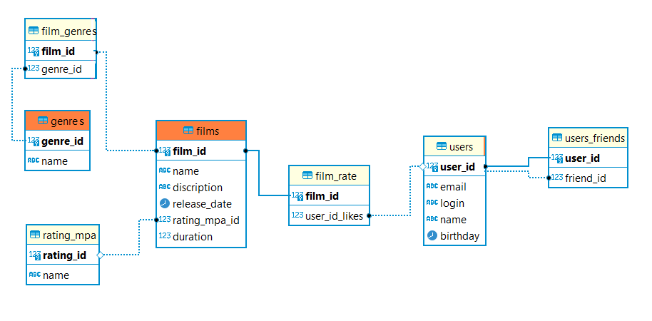

# java-filmorate
Template repository for Filmorate project.

# Описание диаграммы базы данных фильмов и пользователей

## База данных состоит из следующих таблиц:

1) films – данные фильмах
2) film_rate – данные о лайках, поставленных фильму пользователями
3) rating_mpa – наименования рейтингов фильмов Ассоциации кинокомпаний
4) genres – наименования жанров фильмов 
5) film_genres – идентификаторы жанров для конкретных фильмов
6) users – данные пользователей сервиса
7) users_friends – идентификаторы пользователей, добавленных в друзья.

## Поля и ключи таблиц:

### films

1) film_id (PK) – уникальный идентификатор фильма
2) name – название фильма
3) description - описание фильма
4) release_date – дата выхода
5) rating_mpa_id (FK) – идентификатор рейтинга
6) duration - продолжительность в минутах
7) rate - рейтинг популярности фильма

### film_rate

1) film_id (FK) – идентификатор фильма
2) user_id_likes (FK) – идентификатор пользователя, лайкнувшего фильм

### film_genres

1) film_id (FK) – идентификатор фильма
2) genre_id (FK) – идентификатор жанра

### genres

1) genre_id (PK) – идентификатор жанра
2) name – наименование жанра

### rating_mpa

1) rating_id (PK) – идентификатор рейтингов Ассоциации кинокомпаний
2) name – наименование рейтинга

### users

1) user_id (PK) – идентификатор пользователя
2) email – эл. почта пользователя
3) login – логин пользователя
4) name – имя пользователя
5) birthday – дата рождения пользователя

### users_friends

1) user_id (PK) – идентификатор пользователя
2) friend_id (FK) – идентификатор друга пользователя

## Примеры запросов:

### Получить данные по фильму с id = 2, включая наименование категоии МРА:

    SELECT F.FILM_ID, 
        F.NAME AS FILM_NAME, 
        F.RELEASE_DATE, 
        F.DESCRIPTION, 
        F.DURATION, 
        F.RATING_MPA_ID, 
        R.NAME AS RATING_MPA 
    FROM FILMS AS F 
    JOIN RATING_MPA AS R ON F.RATING_MPA_ID = R.RATING_ID 
    WHERE F.FILM_ID = 2;

### Получить список из 10 самых популярных фильмов:

    SELECT F.FILM_ID, 
        F.NAME AS FILM_NAME, 
        F.RELEASE_DATE, 
        F.DESCRIPTION, 
        F.DURATION, 
        F.RATING_MPA_ID, 
        R.NAME AS RATING_MPA, 
        COUNT(FR.USER_ID) AS RT
    FROM FILMS AS F 
    JOIN RATING_MPA AS R ON F.RATING_MPA_ID = R.RATING_ID
    LEFT JOIN FILM_RATE AS FR ON F.FILM_ID = FR.FILM_ID
    GROUP BY F.FILM_ID
    ORDER BY RT DESC
    LIMIT 10;

### Получить список из общих друзей пользователя с id = 1 и пользователя с id = 2:

    SELECT * FROM USERS 
    WHERE USER_ID IN (
        SELECT FRIEND_ID 
        FROM USERS_FRIENDS 
        WHERE USER_ID = 1 
        INTERSECT 
        SELECT FRIEND_ID 
        FROM FRIENDS 
        WHERE USER_ID = 2
        );